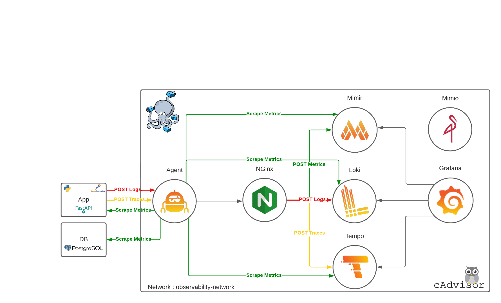

# Why

This repository contain an observability stack using Grafana Labs tools.  
These one is deploying with Docker Compose to test all the stack's tools.  

It is only a testing stack with no security, no production-ready configuration, ...  
This for testing purpose.  

# Architecture

Mimir, Loki and Tempo are deploy in Monolithic mode with 3 instances of each.  

# Prerequisite

1. Install [Docker](https://docs.docker.com/engine/install/) . 
2. Create Docker network :  
`docker network create observability-network`

# How deploy it

1. Clone this repository :  
`git clone https://github.com/tonyglandyl28/observability_docker.git`
2. Build & deploy :  
`docker-compose --profile grafana up --build`
3. Access to Grafana for visualization :  
*http://localhost:3000*

# How to send logs/metrics/traces

Deploy an application or database or other on the same docker network with these parameters :  
1. Traces :  
- Protocol : http
- Host : agent
- Port : 4318
- Path : /v1/traces
2. Logs :  
- Protocol : http
- Host : agent
- Port : 3500
- Path : /loki/api/v1/push
3. Expose Metrics with Prometheus (or based on Prometheus) on port : `8000` and modify the **targets** value in [agent.yaml](./agent/agent.yaml) (line 24).

# Sources

|                   Logo/Link                   |      Version    |               Usage                 |            Link            |
|:---------------------------------------------:|-----------------|-------------------------------------|----------------------------|
|  | v0.29.0 | Used to scrape data from applications (front, back, databases, ...) and send to each specific storage (like OpenTelemetry Collector). | https://github.com/grafana/agent/blob/main/example/docker-compose/docker-compose.yaml |
|  | v1.5.0 | Used to store Traces (like Jaeger or Zipkin). | https://github.com/grafana/tempo/tree/main/example/docker-compose/scalable-single-binary |
|  | v2.4.0 | Used to store Metrics (like Prometheus or Cortex). | https://github.com/grafana/mimir/blob/main/docs/sources/mimir/tutorials/play-with-grafana-mimir/docker-compose.yml |
|  | v2.7.0 | Used to store Logs (like Elasticsearch). | https://github.com/grafana/loki/tree/main/examples/getting-started |
|  | v9.3.1 | Used to visualize data (like Kibana). | https://github.com/grafana/grafana |
|  | Latest | Used to load balance traffic between each instance (on Cloud, use S3, Google Cloud Storage or similar). | https://github.com/minio/minio |
|  | Latest | Used to load balance traffic between each instance. | https://github.com/nginx/nginx |